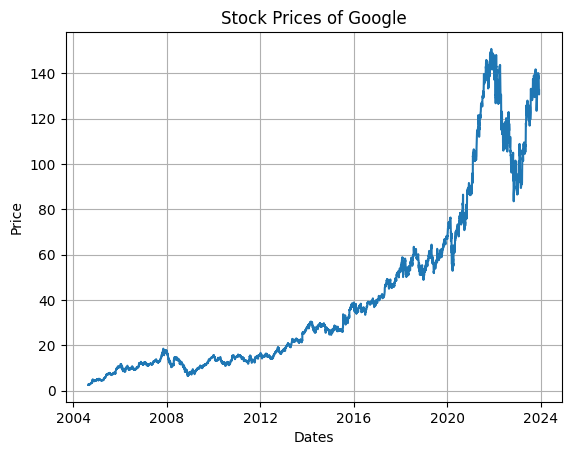
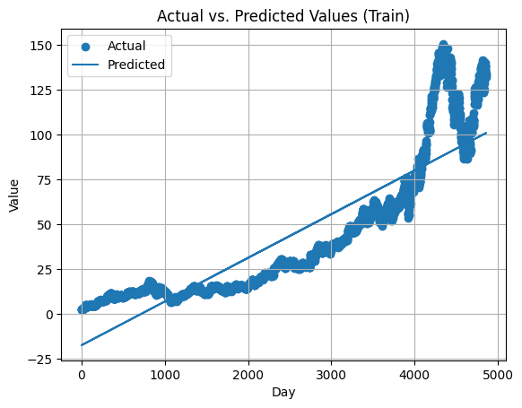

# Stock Market Price Predictor

## Overview
This project is a **Stock Market Price Predictor** built using **Linear Regression**. It aims to predict future stock prices based on historical data. The project demonstrates how machine learning can be applied to financial markets and provides insights into the stock price trends.

## Features
- Predict future stock prices using historical data.
- Visualize trends and predictions with graphs.
- Simple and easy-to-use implementation with Python.

## Technologies Used
- **Programming Language**: Python
- **Libraries**:
  - NumPy
  - Pandas
  - Matplotlib
  - scikit-learn

## Installation
1. Clone this repository:
   ```bash
   git clone https://github.com/souradeepdutta/Stock-Market-Price-Predictor.git
   ```
2. Import Notebook in Kaggle and run notebook

## Usage
1. Import a dataset from Kaggle

2. Run the notebook.

3. The program will:
   - Load the dataset.
   - Train the Linear Regression model.
   - Predict future prices.
   - Display a graph comparing actual vs predicted prices.

## Output




## Contributing
Contributions are welcome! If you have suggestions or improvements, feel free to:
- Fork this repository.
- Create a new branch.
- Submit a pull request.

## License
This project is licensed under the MIT License. See the [LICENSE](LICENSE) file for details.

---

**Disclaimer**: This project is for educational purposes only and should not be used for actual financial decisions. Always consult a financial advisor before making investment decisions.
